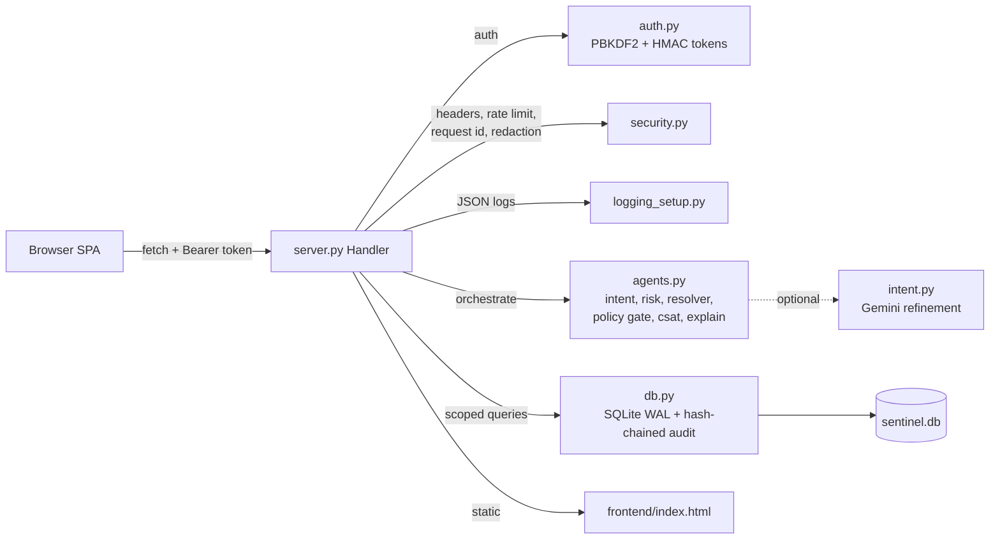

# Architecture — Sentinel

## Shape
A **modular monolith**: one Python process serves the API and the static
frontend, backed by a single SQLite file. Chosen for a small team and minimal
ops; the modules are cleanly separated so any one can be extracted later.

## Components
| Component | Responsibility | Risk |
| --- | --- | --- |
| `server.py` | Routing, auth enforcement, orchestration, headers, shutdown | Highest-trust boundary; keep handlers thin |
| `auth.py` | Password hashing, token issue/verify | Custom crypto-adjacent code; well-tested |
| `security.py` | Headers, rate limiting, request IDs, redaction | In-process limiter only scales to one instance |
| `agents.py` | Deterministic decisions, policy, CSAT, rationale | Must stay pure/deterministic for auditable replay |
| `db.py` | Persistence + audit chain | SQLite single-writer; append lock needed |
| `intent.py` | Optional LLM refinement | External network; must fail safe (rule-based wins) |

## Background jobs
There are none: every request is fast (no email, no third-party calls on the
hot path). The optional LLM call is the only external latency and is timeout-
bound. If slow work is added, move it to a background worker rather than the
request (see `docs/monitoring.md`).

## Third-party services
None required. Optional: Google Gemini (intent refinement) with a timeout and a
deterministic fallback. Google Fonts is loaded by the SPA and can be removed for
a fully self-contained deployment.

## Riskiest decisions
1. **Zero-dependency stdlib backend** — great portability and auditability, but
   we own security details a framework would provide. Mitigated by tests + docs.
2. **In-process rate limiting** — correct for one process, insufficient for
   multiple instances. Documented as a scaling task.
3. **SQLite under a threaded server** — mitigated with WAL, a busy timeout,
   per-thread connections and a lock around audit appends.
